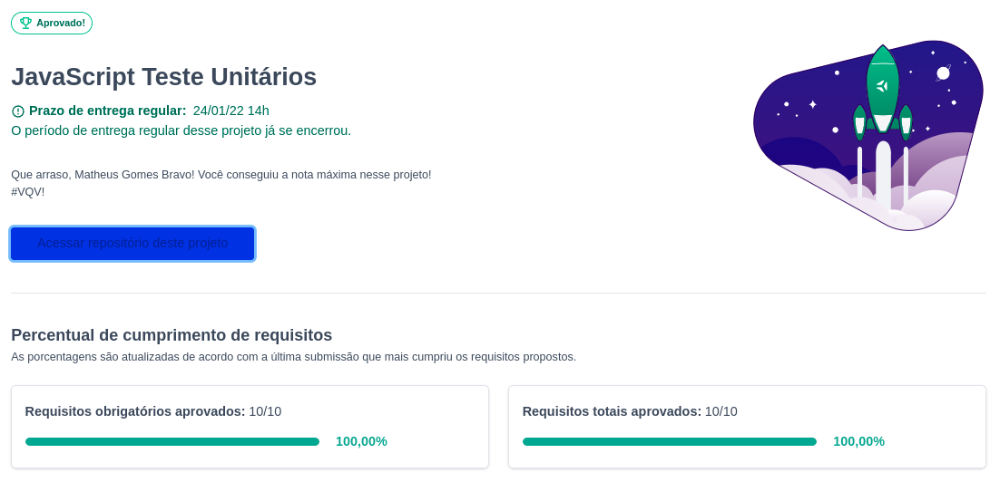

# JS unit tests
Projeto feito enquanto estudava na [Trybe](https://www.betrybe.com/), utilizando Jest e Javascript no módulo de fundamentos. Entregue com 100% dos requisitos respeitando o ESLint. (Alguns requisitos eu teria que desenvolver o teste Jest, em outros requisitos eu teria que desenvolver o código javascript para atender os testes já feitos.)

## Direitos autorais

Esse projeto foi desenvolvido por mim ([Matheus Gomes](https://www.linkedin.com/in/matheusgb/)) apenas visando o aprendizado.

